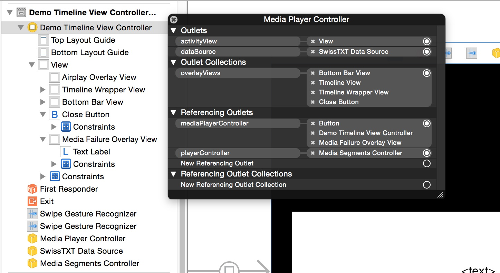
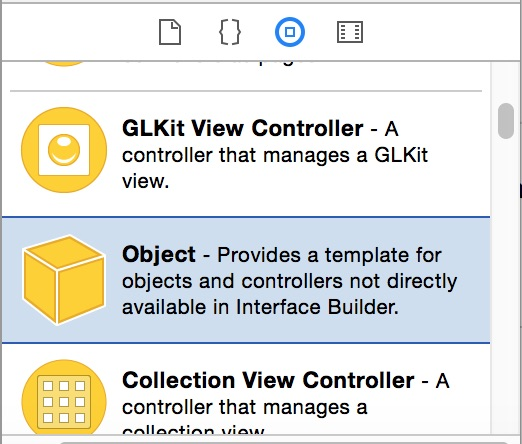

Getting started
===============

The SRG Media Player library is made of separate building blocks. Those components can be combined together depending on your application needs.

## Architecture

At the highest level, the library intends to provide a default player view controller which can be instantiated in a few keystrokes, much like the system `MPMoviePlayerViewController`. It supports only limited features of the library and its layout, similar to the one of the system player, cannot be customized.

This default player view controller is itself based on a set of components which you can combine to match your requirements:

* A media player controller, which can be optionally attached to a view for playing videos
* A segments controller, which controls playback based on segment information (e.g. preventing seeking in blocked segments)
* A set of components (slider, play / pause button, timeline, message view, Airplay view, etc.) which can be connected to an underlying media player controller
* A few protocols which describe how controllers retrieve the data they need, and how playback can be controlled

Let us now discuss these components further and describe how they are glued together.

## Media player view controller

If you do not need to customize the player appearance, simply instantiate `RTSMediaPlayerViewController` and install it somewhere into your view controller hierarchy, e.g. modally:

```
#!objective-c
RTSMediaPlayerViewController *mediaPlayerViewController = [[RTSMediaPlayerViewController alloc] initWithContentURL:contentURL];
[self presentViewController:mediaPlayerViewController animated:YES completion:nil];
```

The player can simply be supplied the URL to be played. Alternatively, you can provide a data source and an identifier for which the URL must be retrieved from the data source. More on this topic in _Data sources_ section.

The `RTSMediaPlayerViewController` class natively supports all kind of audio and video streams (VOD, live and DVR streams), but does not provide support for segments. For this you need to design your own player view, see the _Designing custom players_ section below.

## Data sources

Each controller class has an associated protocol describing how it is fed with data. Controllers are only concerned with media identifiers (strings), for which they ask their data source about data:

* `RTSMediaPlayerControllerDataSource`: Describes how a media player controller retrieves the URL to be played
* `RTSMediaSegmentsDataSource`: Describes how a media segments controller retrieves segment information. Segments can be any kind of class conforming to the `RTSMediaSegment` protocol

A data source is implicitly provided to an `RTSMediaPlayerViewController` when it is instantiated (see example in the _Media player view controller_ section).

For `RTSMediaPlayerController` and `RTSMediaSegmentsController`, the data source is not provided at creation time, rather specified using dedicated `dataSource` properties. Those have been made available as outlets. The SRG Media Player library namely intends to provide an easy way to create custom player layouts not only in code, but also in Interface Builder for convenience. This topic is discussed further in the next section.

## Designing custom players without segment support

Custom player layouts can be designed entirely in Interface Builder.



Start by adding a view controller to a storyboard file, and drop two custom objects from Xcode _Utilities_ panel:



The first object class must be set to `RTSMediaPlayerController`, while the other one must be set to a custom data source class you must create, conforming to `RTSMediaPlayerControllerDataSource`. Bind the `dataSource` outlet of the media player controller to its data source.

Creating the player layout is then a matter of dropping more views onto the layout, setting their resizing behavior, and connecting the various outlets at hand. The media player controller itself has three main outlets:

* `dataSource`, described above
* `activityView`, where taps are detected to toggle on or off UI overlay views
* the `overlayViews` collection, which contains all views you want to be toggled off after user inactivity, or by interacting with the activity view when overlays are visible. Those overlay views will be toggled on again when interacting with the activity view again

Several controls can then be dropped onto the layout and bound to the player they must be associated with, usually through a `...controller` outlet. Simply use a standard `UIView` in Interface Builder, setting its class to one of the following types:

* `RTSMediaPlayerPlaybackButton`: A play / pause button to control the underlying player
* `RTSTimeSlider`: A time slider, describing the current playback position, and allowing to seek. Two label outlets can be optionally attached to display the elapsed and remaining times (_Live_ for live streams).
* `RTSVolumeView`: A view to control volume. Does not need any outlet binding
* `RTSPlaybackActivityIndicatorView`: An activity indicator automatically shown or hidden depending on the player activity
* `RTSMediaFailureOverview`: A view displaying player error messages, and hidden when there is none
* `RTSAirplayOverviewView`: A view displayed when Airplay output is active

For more information about these classes and how they can be customized, please refer to the associated header files. If you need to implement your own custom view, the SRG Media Player library provides further access to playback information, a more advanced topic not covered in this guide.

To start playback, bind your media player controller to an `mediaPlayerController` outlet you need to add to your view controller class, and start playback as soon as your view controller appears:

```objective-c
- (void)viewWillAppear:(BOOL)animated
{
    [super viewWillAppear:animated];

    if ([self isMovingToParentViewController] || [self isBeingPresented]) {
        [self.mediaPlayerController playIdentifier:@"the_video_identifier"];
    }
}
```

Controlling playback can be made programatically using methods from the `RTSMediaPlayback` protocol, described in the next section.

#### Remark

You can also create your layout and instantiate all or part of the controllers and data sources programatically. These cases are not described further in this guide as they should be obvious enough for Cocoa developers.

## Controlling playback

Playback can be controlled using the `RTSMediaPlayback` protocol, to which both controller classes `RTSMediaPlayerController` and `RTSMediaSegmentsController` conform. Most properties of this protocol should be self-explanatory.

Periodic time observers need further discussion, though. Unlike standard `AVPlayer` time observers, these observers are `NSTimer`-based and do not stop when playback stops, but live as long as the player lives. This makes it possible to perform periodic updates, even when the player is paused.

If you need standard time observers, you can use the `player` property of `RTSMediaPlayerController`. Be careful, though, as such observers can only be added when the `player` property is actually ready (use KVO to detect it).

## Designing custom players with segment support

Adding support for segments to a custom player happens in the same way as described in the _Designing custom players without segment support_ section. Add two custom objects to your storyboard:

* Set the class of the first one to a `RTSMediaSegmentsDataSource` you have implemented
* Set the class of the first one to `RTSMediaSegmentsController`, bind its `playerController` outlet to the media player controller it must manage, and bind its `dataSource` outlet to the data source

To retrieve segments, call `-reloadSegmentsForIdentifier:completionHandler:`. Your data source can implement segment data retrieval, e.g. through a webservice request, returing objects conforming to the `RTSMediaSegment` protocol.

Segments can be easily displayed using two dedicated view classes. Drop `UIView `instances onto your player layout and set their class to either:

* `RTSTimelineSlider`: A timeline displaying segment start points and providing a way to seek with a single tap. You can use a delegate protocol to display custom icons if you want
* `RTSSegmentedTimelineView`: An horizontal list of cells displaying segments, used like a collection view.

Do not forget to bind the `segmentsController` property of such views to the segments controller so that they are fed properly. For more information, please refer at the header documentation of those classes.

Controlling playback is achieved using the `RTSMediaPlayback`. Calling the methods onto the segments controller allows mediating between the user and the media player controller. Based on segments information, the segments controller may namely forbid scrubbing to a specific location or resume after a blocked segment.

## Further reading

This guide only scratches the surface of what you can do with the SRG Media Player library. For more information, please have a look at the demo implementation. Do not forget to read the header documentation as well.
