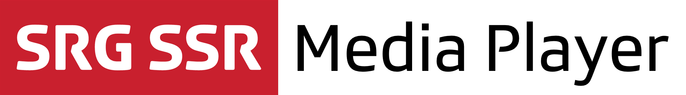

## About

The SRG Media Player library for iOS provides a simple way to add a universal audio / video player to any application. It provides:

* A default player with the same look & feel as the standard iOS player
* A set of overlays which can be combined to create the user interface you need
* Support for segments. Those are simply sections of a video, defined by non-overlapping time ranges, which can be blocked or hidden
* Support for DVR streams
* Ability to use several instances of the player at the same time

## Compatibility

The library is suitable for applications running on iOS 7 and above.

## Installation

The library can be added to a project using [CocoaPods](http://cocoapods.org/) by adding the `SRGMediaPlayer` dependency to its `Podfile`:
    
```ruby
pod 'SRGMediaPlayer', '<version>'
```

For more information about CocoaPods and the `Podfile`, please refer to the [official documentation](http://guides.cocoapods.org/).

## Demo project

To test what the library is capable of, try running the associated demo by opening the workspace and building the associated scheme.

## Usage

To learn about how the library can be used, have a look at the [getting started guide](Documentation/Getting-started.md).

## License

See the [LICENSE](LICENSE) file for more information.
