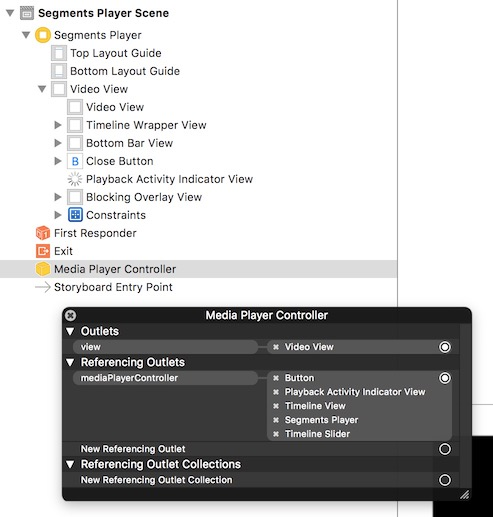

Getting started
===============

The SRG Media Player library is made of separate building blocks:

* A standard `AVPlayerViewController`-based player for straightforward integration.
* A core `AVPlayer`-based controller to play medias, optionally with support for a logical playback structure (segments).
* A set of overlays to be readily used with it.

Those components can be combined together depending on your application needs. A ready-to-use player view controller is also provided.

## Core principles

The library provides an `AVPlayer`-based controller which provides a clean and powerful API for playback. An `AVPlayerViewController` lightweight subclass, `SRGMediaPlayerViewController`, ensures compatibility with the standard native iOS or tvOS player.

Custom player layouts can also be created by connecting a controller with a set of UI components, provided as well (slider, play / pause button, timeline, message view, AirPlay overlay, etc.). This feature is only available on iOS since, as recommended by Apple, the tvOS user experience should be close to the native player.

The following further discusses these components and describe how they can be glued together.

## Media player view controller

If you do not need to customize the player appearance, simply instantiate `SRGMediaPlayerViewController` and display it. This class is a simple `AVPlayerViewController` subclass, available both for iOS and tvOS, thus having the exact same look & feel as the standard system player. 

The view controller exposes its underlying `controller` property, which you must use to start playback:

```objective-c
SRGMediaPlayerViewController *mediaPlayerViewController = [[SRGMediaPlayerViewController alloc] init];
[self presentViewController:mediaPlayerViewController animated:YES completion:^{
    [mediaPlayerViewController.controller playURL:contentURL];
}];
```

Please refer to `AVPlayerViewController` [documentation](https://developer.apple.com/documentation/avkit/avpictureinpicturecontroller) for further integration instructions, from picture in picture support to optional settings.

### Remark

You must opt-in for picture in picture by setting the `pictureInPictureEnabled` property to `YES`. Picture in picture also requires your application to declare the corresponding background mode capability, as well as an audio session category set to `AVAudioSessionCategoryPlayback`. 

## Designing custom players

Custom player layouts can be designed entirely in Interface Builder, whether you are using xibs or storyboards. You can create your custom player entirely in code if you want, but using Interface Builder is recommended.



Start by adding a view controller to a storyboard file. Drop a custom object from the library and set its class to `SRGMediaPlayerController`. This controller object will manage playback of medias.

Creating the player layout is then a matter of dropping more views onto the layout, setting their constraints, and connecting them to the media player controller:

* To set where the player controller must display videos (if you want to play videos), add a view to your hierarchy, set its class to `SRGMediaPlayerView`, and bind it to the media player controller `view` property.
* You can drop one of the available overlay classes and bind their `mediaPlayerController` property directly in Interface Builder. Most views are available for iOS only, as the user experience on tvOS should be standard and based on `SEGMediaPlayerViewController`. No additional setup (except for appearance and constraints) is usually required, as those components are automatically synchronized with the controller they have been attached to. Built-in overlay classes include most notably:
  * `SRGPlaybackButton`: A play / pause button.
  * `SRGTimeSlider`: A time slider with elapsed and remaining time label support.
  * `SRGPlaybackActivityIndicatorView`: An activity indicator.

For a more thorough description of the player controller and the associated overlays, have a look at the documentation available from the `SRGMediaPlayerController` header file.

To start playback, bind your media player controller to a `mediaPlayerController` outlet of your view controller class and start playback soon enough, for example:

```objective-c
- (void)viewWillAppear:(BOOL)animated
{
    [super viewWillAppear:animated];

    if (self.movingToParentViewController || self.beingPresented) {
        NSURL *mediaURL = [NSURL URLWithString:@"http://..."];
        [self.mediaPlayerController playURL:mediaURL];
    }
}
```

This is it. If you then bound a playback button or a slider to the player controller using Interface Builder, you should readily be able to control playback as well.

## Displaying segments

To display segments, you must first have a class conform to the `SRGSegment` protocol, which captures the definition of a segment:

* Segments correspond to a time range for the media URL being played.
* Segments can be optionally blocked to prevent users from seing them.

Once you have segments, simply supply them to the player controller when playing a URL:

```objective-c
[self.mediaPlayerController playURL:mediaURL withSegments:segments];
```

Note that overlapping segments are not supported yet and lead to undefined behavior.

The player controller will then emit notifications when segments are being played and skip over blocked ones.

On iOS, you can display segments using the dedicated built-in `SRGTimelineView` overlay class by drpping an instance onto your view controller layout and bind it to your media player controller.

On tvOS, you should use `SRGMediaPlayerViewController`, which provides the standard top information panel from which sequences can be accessed. To populate this panel, return navigation markers by implementing the corresponding `SRGMediaPlayerViewControllerDelegate` protocol methods.

## AirPlay support (iOS)

AirPlay configuration is entirely the responsibilty of client applications. `SRGMediaPlayerController` exposes three block hooks where you can easily configure AirPlay playback settings as you see fit:

* `playerCreationBlock`: Called when the `AVPlayer` is created.
* `playerConfigurationBlock`: Called when the `AVPlayer` is created, and when a configuration reload is requested.
* `playerDestructionBlock`: Called when the `AVPlayer` is released.

To add basic AirPlay support to your application, you can for example:

* Enable the corresponding background mode for your target.
* Enable `allowsExternalPlayback` (which is the default) and `usesExternalPlaybackWhileExternalScreenIsActive` (to switch to full-screen playback when mirroring is active) in the `playerConfigurationBlock`.

You can also drop an `SRGAirPlayButton` onto your layout (displayed only when AirPlay is available) or an `SRGAirPlayView` (displaying the current route when AirPlay is active).

#### Warning

If you want users to reliably enable AirPlay playback also from the control center, you should use `SRGAirPlayButton` with your player layout, or integrate `MPRemoteCommandCenter`. These ensures your application is the current one registered with the control center when the user interacts with it, so that playback can actually be sent to an AirPlay receiver. If your application is not the current one at the moment the route is changed in the control center, playback will stay local.

## Audio session management

No audio session specific management is provided by the library. Managing audio sessions is entirely the responsibility of the application, which gives you complete freedom over how playback happens, especially in the background or when switching between applications. As for AirPlay setup (see above), you can use the various block hooks to setup and restore audio session settings as required by your application.

For more information, please refer to the [official documentation](https://developer.apple.com/library/ios/documentation/Audio/Conceptual/AudioSessionProgrammingGuide/Introduction/Introduction.html). Audio sessions are a somewhat tricky topic, you should therefore read the documentation well, experiment, and test the behavior of your application on a real device. 

In particular, you should ask yourself:

* What should happen when I was playing music with another app and my app is launched? Should the music continue? Maybe resume after my app stops playing?
* Do I want to be able to control AirPlay playback from the lock screen or the control center?
* Do I want videos to be _listened to_ when the device is locked, maybe also when the application is in the background?

Moreover, you should check that your application behaves well when receiving phone calls (in particular, audio playback should stop).

## Control center integration (iOS)

For proper integration into the control center and the lock screen, use the `MPRemoteCommandCenter` class and set your audio session category to `AVAudioSessionCategoryPlayback`. For more information, please refer to the `MPRemoteCommandCenter` documentation.

Note that control center integration does not work in the iOS simulator, you will need a real device for tests.

#### Warning

Do not use `[UIApplication.sharedApplication beginReceivingRemoteControlEvents]`. This would result in control center playback buttons flickering between states.

## Subtitles and audio tracks

SRG Media Player provides on iOS a built-in `SRGTracksButton` which, when added to a player layout and bound to a media player controller, is displayed when audio or subtitle options are detected. Tapping on this button lets the user choose one of the options provided by the media being played. 

Subtitle choice made using this button is persisted at the system level, and will be reapplied in subsequent playback contexts, e.g. when playing another media with `SRGMediaPlayerController`, `AVPlayerViewController` or even Safari. Conversely, choices made in other playback contexts will also determine the initial default audio and subtitle selection for `SRGMediaPlayerController`. Please refer to the [official MediaAccessibility framework documentation](https://developer.apple.com/documentation/mediaaccessibility) for more information.

On tvOS, the standard media player provides a top panel to change subtitles and audio tracks. No dedicated button is required, and thus none is made available by the framework.

You can programmatically control subtitles and audio tracks by setting `audioConfigurationBlock` and `subtitleConfigurationBlock` blocks on the controller. These blocks get called when playback starts, once the media `AVAsset` is safe for media selection option inspection. Here is for example how you would apply German audio and French subtitles if available:

```objective-c
self.mediaPlayerController.audioConfigurationBlock = ^AVMediaSelectionOption * _Nonnull(NSArray<AVMediaSelectionOption *> * _Nonnull audioOptions, AVMediaSelectionOption * _Nonnull defaultAudioOption) {
    NSPredicate *predicate = [NSPredicate predicateWithBlock:^BOOL(AVMediaSelectionOption * _Nullable option, NSDictionary<NSString *,id> * _Nullable bindings) {
        return [[option.locale objectForKey:NSLocaleLanguageCode] isEqualToString:@"de"];
    }];
    return [audioOptions filteredArrayUsingPredicate:predicate].firstObject ?: defaultAudioOption;
};
self.mediaPlayerController.subtitleConfigurationBlock = ^AVMediaSelectionOption * _Nullable(NSArray<AVMediaSelectionOption *> * _Nonnull subtitleOptions, AVMediaSelectionOption * _Nullable audioOption, AVMediaSelectionOption * _Nullable defaultSubtitleOption) {
    NSPredicate *predicate = [NSPredicate predicateWithBlock:^BOOL(AVMediaSelectionOption * _Nullable option, NSDictionary<NSString *,id> * _Nullable bindings) {
        return [[option.locale objectForKey:NSLocaleLanguageCode] isEqualToString:@"fr"];
    }];
    return [subtitleOptions filteredArrayUsingPredicate:predicate].firstObject ?: defaultSubtitleOption;
};
``` 

If for some reason the audio and / or subtitle choice must be updated during playback, call `-[SRGMediaPlayerController reloadMediaConfiguration]` so that these blocks get called again.

You can also customize subtitle styling as well if needed:

```objective-c
AVTextStyleRule *rule = [[AVTextStyleRule alloc] initWithTextMarkupAttributes:@{ (id)kCMTextMarkupAttribute_ForegroundColorARGB : @[ @1, @1, @0, @0 ],
                                                                                 (id)kCMTextMarkupAttribute_ItalicStyle : @(YES)}];
self.mediaPlayerController.textStyleRules = @[rule];
``` 

## Custom resource loading and FairPlay support

If you need to customize the resource loading process (e.g. to unencrypt stream chunks on-the-fly or to optimize the way they are retrieved), create a dedicated `AVAssetResourceLoaderDelegate` class. Then play an `AVURLAsset` which this delegate has been assigned to:

```objective-c
AVURLAsset *URLAsset = ...;
[asset.resourceLoader setDelegate:resourceLoaderDelegate queue:queue];
[self.mediaPlayerController playURLAsset:URLAsset];
```

where `resourceLoaderDelegate` is an instance of your custom resource loader delegate class, and `queue` is the queue on which events must be dispatched.

In particular, FairPlay requires the use of a custom resource loader delegate for license retrieval. Please refer to the [official FairPlay documentation](https://developer.apple.com/streaming/fps) for more information.

## Device sleep mode

The new `preventsDisplaySleepDuringVideoPlayback` `AVPlayer` property added with iOS and tvOS 12 provides a way to control whether video playback should prevent the device from going to sleep.

While you can setup this property in the player configuration block, note that `SRGMediaPlayerController` overrides it in some cases:

- If no view has been attached to the controller or if the view is not installed within a view hierarchy, the value is forced to `NO` so that the device can go to sleep.
- On iOS, when picture in picture is used, the value is forced to `YES` so that the screen remains active.
- On iOS, when AirPlay is used, the value is forced to `NO` so that the device can go to sleep automatically during playback on the receiver.

No overriding is performed when using `SRGMediaPlayerViewController`, though.

## Thread-safety

The library is intended to be used from the main thread only.

## Further reading

This guide only scratches the surface of what you can do with the SRG Media Player library. For more information, please have a look at the demo implementations and check the header documentation (especially the `SRGMediaPlayerController` header documentation, which covers all topics extensively).
